# Matriz das 20 atividades — V3

Gerada a partir de `activities-v3.js`, em 16/09/2026. Coordenadas são linha/coluna, base zero. As plantas são revisões estáticas com regiões reveladas, não screenshots do navegador.

As salas pequenas de partida, bifurcação, retorno e saída têm função de navegação verificável. Alas opcionais são identificadas; não é necessário visitar todos os tiles de uma região. Tentativas são estimativas pedagógicas, não resultados de playtest.

## 1. Primeiros Passos

| Campo | Definição |
|---|---|
| Unidade / dificuldade | 1 / tutorial |
| Objetivo | Explore a câmara lateral e acenda a luz que revela a saída. Guarde distâncias em variáveis. |
| Python | Atribuição de variável e movimento orientado; whitelist: variables, strings, booleans, arithmetic |
| Mapa | 15 × 11; início (7, 2), Leste |
| Regiões obrigatórias | Câmara da luz; retorno à passagem central. |
| Estrutura | Uma câmara lateral de luz abre o selo da saída; voltar ao corredor é obrigatório. |
| Mecânicas | interruptor de luz, grade/cofre |
| Variantes | Cenário único |
| Tentativas esperadas | 1–2; estimativa, sem forçar repetição |
| Orçamento | Sem limite específico; guardas globais continuam ativos |

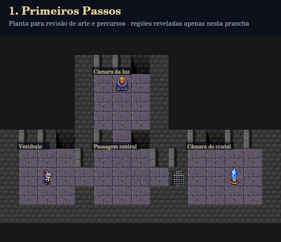

### Regiões e propósito

| Região | Posição e tamanho | Luz inicial | Função |
|---|---|---|---|
| Vestíbulo (entrada) | 6,1; 3×3 | lit | Partida e orientação antes da primeira decisão. |
| Câmara da luz (camara) | 2,5; 3×3 | dark | interruptor de luz: luz |
| Passagem central (nexo) | 6,5; 3×3 | lit | Bifurcação, acesso ou retorno entre regiões funcionais; sem sala de enchimento isolada. |
| Câmara do cristal (final) | 6,10; 4×3 | dark | Cristal/recompensa, acessível após os requisitos físicos. |

### Pistas e dependências

Sem resposta textual secreta; investigação por geometria e estados físicos.

- **selo**: `{"requires":["light_final"]}`

Objetivos verificados: Use uma variável para conduzir Guto; Acenda o interruptor da câmara lateral; Alcance o cristal após liberar a passagem.

Solução integral no gabarito da raiz. Estado detalhado e evidências em `evidencias/auditoria.json`.

## 2. O Caminho Mutável

| Campo | Definição |
|---|---|
| Unidade / dificuldade | 1 / fácil |
| Objetivo | Uma alavanca distante mantém a passagem final fechada. Encontre-a e reutilize a mesma variável em distâncias diferentes. |
| Python | Reatribuição; whitelist: variables, strings, booleans, arithmetic |
| Mapa | 18 × 15; início (7, 2), Leste |
| Regiões obrigatórias | Ala da alavanca e retorno ao salão. |
| Estrutura | Ala norte obrigatória, retorno ao salão e nicho sul opcional com moeda. |
| Mecânicas | interruptor de luz, alavanca, coletável, grade/cofre |
| Variantes | Cenário único |
| Tentativas esperadas | 2–3; estimativa, sem forçar repetição |
| Orçamento | Sem limite específico; guardas globais continuam ativos |

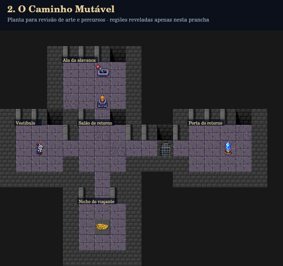

### Regiões e propósito

| Região | Posição e tamanho | Luz inicial | Função |
|---|---|---|---|
| Vestíbulo (entrada) | 6,1; 3×3 | lit | Partida e orientação antes da primeira decisão. |
| Salão de retorno (hub) | 6,5; 3×3 | lit | Bifurcação, acesso ou retorno entre regiões funcionais; sem sala de enchimento isolada. |
| Ala da alavanca (alavanca) | 2,4; 4×3 | dark | interruptor de luz: luz; alavanca: lever |
| Nicho do viajante (tesouro) | 11,5; 3×3 | lit | coletável: moeda — alternativa/opcional |
| Porta do retorno (final) | 6,12; 4×3 | dark | Cristal/recompensa, acessível após os requisitos físicos. |

### Pistas e dependências

Sem resposta textual secreta; investigação por geometria e estados físicos.

- **porta**: `{"requires":["leverDone"]}`

Objetivos verificados: Use uma variável para conduzir Guto; Reatribua uma variável durante o percurso; Ative a alavanca na ala remota; Alcance o cristal após liberar a passagem.

Solução integral no gabarito da raiz. Estado detalhado e evidências em `evidencias/auditoria.json`.

## 3. As Grades da Masmorra

| Campo | Definição |
|---|---|
| Unidade / dificuldade | 1 / média |
| Objetivo | Investigue os dois arquivos. Use os registros para calcular as distâncias e abrir as grades. |
| Python | Operações entre variáveis; whitelist: variables, strings, booleans, arithmetic |
| Mapa | 22 × 16; início (7, 2), Leste |
| Regiões obrigatórias | Os dois arquivos, em lados opostos. |
| Estrutura | Arquivos em lados opostos do corredor; ambas as leituras destravam a grade central. |
| Mecânicas | interruptor de luz, inscrição, grade/cofre |
| Variantes | Cenário único |
| Tentativas esperadas | 2–4; estimativa, sem forçar repetição |
| Orçamento | Sem limite específico; guardas globais continuam ativos |

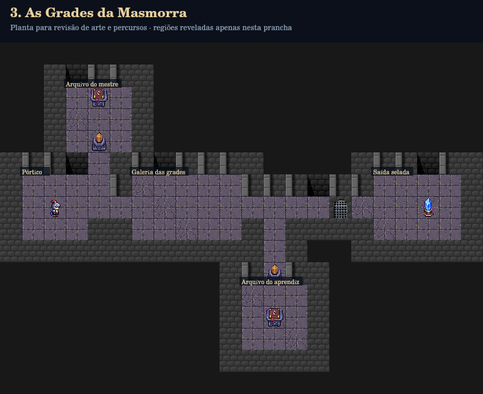

### Regiões e propósito

| Região | Posição e tamanho | Luz inicial | Função |
|---|---|---|---|
| Pórtico (entrada) | 6,1; 3×3 | lit | Partida e orientação antes da primeira decisão. |
| Arquivo do mestre (arquivo_a) | 2,3; 3×3 | dark | interruptor de luz: luz_a; inscrição: base |
| Galeria das grades (central) | 6,6; 5×3 | lit | Bifurcação, acesso ou retorno entre regiões funcionais; sem sala de enchimento isolada. |
| Arquivo do aprendiz (arquivo_b) | 11,11; 3×3 | dark | inscrição: fator |
| Saída selada (final) | 6,17; 4×3 | dark | Cristal/recompensa, acessível após os requisitos físicos. |

### Pistas e dependências

- **base**, (2,4): A unidade do mestre é 2. Duas unidades medem a escada do arquivo.
- **fator**, (12,12): Três unidades medem a galeria além da última grade. Some uma casa para alcançar o cristal.

- **grade**: `{"requires":["read_base","read_fator"]}`

Objetivos verificados: Leia o caderno do mestre; Leia o caderno do aprendiz; Calcule uma distância com operações; Use uma variável para conduzir Guto; Alcance o cristal após liberar a passagem.

Solução integral no gabarito da raiz. Estado detalhado e evidências em `evidencias/auditoria.json`.

## 4. O Corredor da Forja

| Campo | Definição |
|---|---|
| Unidade / dificuldade | 1 / média-difícil |
| Objetivo | Ilumine o piso suspeito. Use a oficina para recolher os espinhos ou percorra a passarela de inspeção. A lava fica no fosso. |
| Python | Operadores +, - e *; whitelist: variables, strings, booleans, arithmetic |
| Mapa | 22 × 16; início (7, 2), Leste |
| Regiões obrigatórias | Sala da lâmpada; oficina de segurança OU passarela de inspeção. |
| Estrutura | Câmara de luz ao norte e oficina ao sul; travessia curta com espinhos ou retorno pela passarela mais longa. |
| Mecânicas | interruptor de luz, espinhos, alavanca, grade/cofre |
| Variantes | Cenário único |
| Tentativas esperadas | 3–5; estimativa, sem forçar repetição |
| Orçamento | 28 |

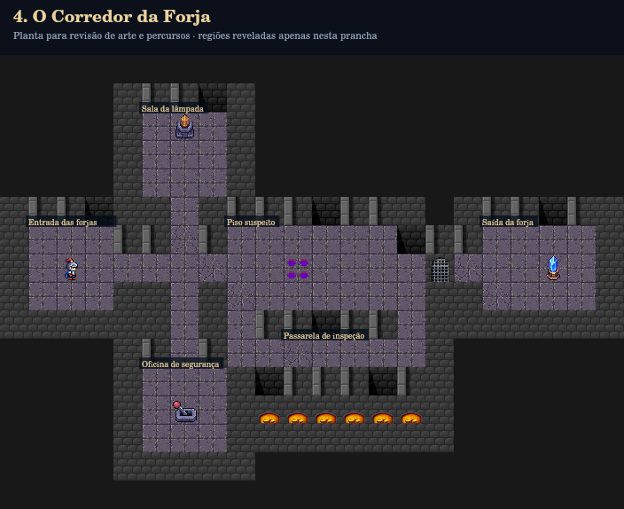

### Regiões e propósito

| Região | Posição e tamanho | Luz inicial | Função |
|---|---|---|---|
| Entrada das forjas (entrada) | 6,1; 3×3 | lit | Partida e orientação antes da primeira decisão. |
| Sala da lâmpada (luz) | 2,5; 3×3 | lit | interruptor de luz: luz |
| Oficina de segurança (mecanismo) | 11,5; 3×3 | lit | alavanca: seguranca — alternativa/opcional |
| Piso suspeito (traps) | 6,8; 6×3 | dark | espinhos: espinhos |
| Passarela de inspeção (detour) | 10,10; 5×1 | lit | Alternativa longa que evita o mecanismo de espinhos e registra a inspeção. — alternativa/opcional |
| Saída da forja (final) | 6,17; 4×3 | dark | Cristal/recompensa, acessível após os requisitos físicos. |

### Pistas e dependências

Sem resposta textual secreta; investigação por geometria e estados físicos.

- **selo**: `{"requires":["light_traps"],"requiresAny":["trapDisabled","visit_detour"]}`

Objetivos verificados: Ilumine a galeria dos espinhos; Use operações para planejar o caminho; Use uma variável para conduzir Guto; Respeite o orçamento de instruções; Alcance o cristal após liberar a passagem.

Solução integral no gabarito da raiz. Estado detalhado e evidências em `evidencias/auditoria.json`.

## 5. O Labirinto das Variáveis

| Campo | Definição |
|---|---|
| Unidade / dificuldade | 1 / boss |
| Objetivo | Conquiste os três selos nas alas da orientação, mudança e cálculo. Volte ao salão e libere o cristal. |
| Python | Integração da Unidade 1; whitelist: variables, strings, booleans, arithmetic |
| Mapa | 23 × 20; início (9, 2), Leste |
| Regiões obrigatórias | Alas da orientação, mudança e cálculo. |
| Estrutura | Hub com três alas obrigatórias e nicho opcional; luz, alavanca e inscrição compõem o selo final. |
| Mecânicas | interruptor de luz, alavanca, inscrição, coletável, grade/cofre |
| Variantes | Cenário único |
| Tentativas esperadas | 4–6; estimativa, sem forçar repetição |
| Orçamento | 38 |

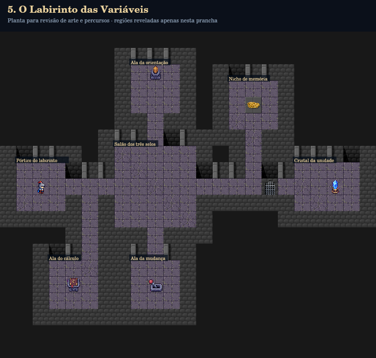

### Regiões e propósito

| Região | Posição e tamanho | Luz inicial | Função |
|---|---|---|---|
| Pórtico do labirinto (entrada) | 8,1; 3×3 | lit | Partida e orientação antes da primeira decisão. |
| Salão dos três selos (hub) | 7,7; 5×5 | lit | Bifurcação, acesso ou retorno entre regiões funcionais; sem sala de enchimento isolada. |
| Ala da orientação (luz) | 2,8; 3×3 | lit | interruptor de luz: luz |
| Ala do cálculo (calculo) | 14,3; 3×3 | dark | inscrição: sigilo |
| Ala da mudança (alavanca) | 14,8; 3×3 | lit | alavanca: mudanca |
| Nicho de memória (reliquia) | 3,14; 3×3 | lit | coletável: moeda — alternativa/opcional |
| Cristal da unidade (final) | 8,18; 4×3 | dark | Cristal/recompensa, acessível após os requisitos físicos. |

### Pistas e dependências

- **sigilo**, (15,4): A porta reconhece quem liga a luz, muda a alavanca e lê este selo. Do corredor central ao cristal, conte três grupos de cinco casas.

- **porta_final**: `{"requires":["light_final","seal_change","read_sigilo"]}`

Objetivos verificados: Conquiste o selo de luz; Conquiste o selo da mudança; Conquiste o selo do cálculo; Use uma variável para conduzir Guto; Reatribua uma variável durante o percurso; Combine operações na navegação; Respeite o orçamento de instruções; Alcance o cristal após liberar a passagem.

Solução integral no gabarito da raiz. Estado detalhado e evidências em `evidencias/auditoria.json`.

## 6. O Pedestal da Palavra

| Campo | Definição |
|---|---|
| Unidade / dificuldade | 2 / tutorial |
| Objetivo | Visite o arquivo, leia a inscrição e dê voz à palavra encontrada junto à runa. |
| Python | print() e saída de dados; whitelist: variables, strings, booleans, arithmetic, print |
| Mapa | 20 × 12; início (7, 2), Leste |
| Regiões obrigatórias | Arquivo antigo e galeria da voz. |
| Estrutura | Arquivo fora da rota principal; print produz luz e abre a grade somente após a leitura. |
| Mecânicas | interruptor de luz, inscrição, runa de saída, grade/cofre |
| Variantes | Cenário único |
| Tentativas esperadas | 2–3; estimativa, sem forçar repetição |
| Orçamento | Sem limite específico; guardas globais continuam ativos |

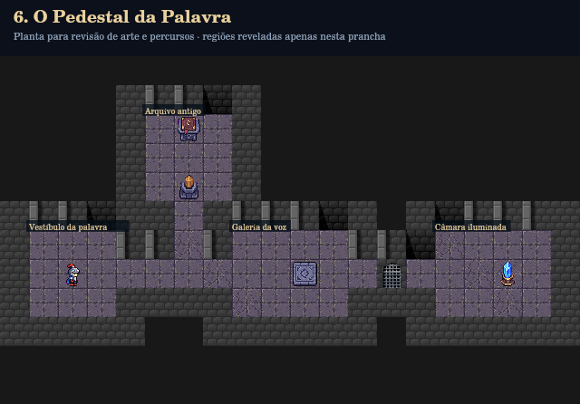

### Regiões e propósito

| Região | Posição e tamanho | Luz inicial | Função |
|---|---|---|---|
| Vestíbulo da palavra (entrada) | 6,1; 3×3 | lit | Partida e orientação antes da primeira decisão. |
| Arquivo antigo (arquivo) | 2,5; 3×3 | dark | interruptor de luz: luz; inscrição: juramento |
| Galeria da voz (runa) | 6,8; 4×3 | lit | runa de saída: runa |
| Câmara iluminada (final) | 6,15; 4×3 | dark | Cristal/recompensa, acessível após os requisitos físicos. |

### Pistas e dependências

- **juramento**, (2,6): Quando a noite caiu sobre o reino, os cavaleiros esperaram a AURORA. Esta é a palavra que a runa conserva.

- **grade**: `{"requires":["read_juramento","wordPrinted"]}`

Objetivos verificados: Leia a inscrição do arquivo; Produza uma saída com print(); Energize a runa com a palavra encontrada; Alcance o cristal após liberar a passagem.

Solução integral no gabarito da raiz. Estado detalhado e evidências em `evidencias/auditoria.json`.

## 7. O Guardião da Resposta

| Campo | Definição |
|---|---|
| Unidade / dificuldade | 2 / fácil |
| Objetivo | Descubra a virtude do antigo juramento na biblioteca e apresente sua resposta ao Guardião. |
| Python | input(), variável e print(); whitelist: variables, strings, booleans, arithmetic, input, print |
| Mapa | 22 × 14; início (9, 2), Leste |
| Regiões obrigatórias | Biblioteca, pedestal, guardião e porta. |
| Estrutura | Corredor escuro leva à biblioteca remota; o pedestal recebe a descoberta e a runa a ecoa para os bloqueios. |
| Mecânicas | interruptor de luz, inscrição, pedestal de entrada, runa de saída, guardião, porta |
| Variantes | Cenário único |
| Tentativas esperadas | 2–4; estimativa, sem forçar repetição |
| Orçamento | Sem limite específico; guardas globais continuam ativos |

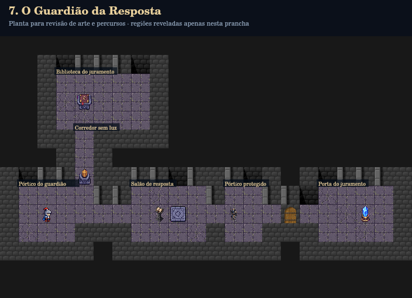

### Regiões e propósito

| Região | Posição e tamanho | Luz inicial | Função |
|---|---|---|---|
| Pórtico do guardião (entrada) | 8,1; 3×3 | lit | Partida e orientação antes da primeira decisão. |
| Biblioteca do juramento (biblioteca) | 2,3; 5×3 | dark | inscrição: memoria |
| Corredor sem luz (sombra) | 5,4; 1×3 | dark | interruptor de luz: luz |
| Salão de resposta (pedestal) | 8,7; 4×3 | lit | pedestal de entrada: pedestal; runa de saída: runa |
| Pórtico protegido (guardiao) | 8,12; 2×3 | lit | guardião: guardian |
| Porta do juramento (final) | 8,17; 4×3 | dark | Cristal/recompensa, acessível após os requisitos físicos. |

### Pistas e dependências

- **memoria**, (3,4): Não foi a força que sustentou os cavaleiros, mas a CORAGEM. O guardião espera ouvir a virtude preservada nesta memória.

- **pedestal**: `{"requiresClues":["memoria"]}`
- **guardian**: `{"requires":["answerEchoed"],"requiresClues":["memoria"]}`
- **door**: `{"requires":["answerEchoed"],"requiresClues":["memoria"]}`

Objetivos verificados: Investigue a memória na biblioteca; Receba a palavra no pedestal; Ecoe a resposta com print(); Libere o Guardião; Abra a porta do juramento; Alcance o cristal após liberar a passagem.

Solução integral no gabarito da raiz. Estado detalhado e evidências em `evidencias/auditoria.json`.

## 8. A Ponte dos Construtores

| Campo | Definição |
|---|---|
| Unidade / dificuldade | 2 / média |
| Objetivo | Investigue as duas oficinas, leia suas quantidades e calcule o material que constrói a travessia. |
| Python | int(input()) e processamento numérico; whitelist: variables, strings, booleans, arithmetic, input, int, print |
| Mapa | 25 × 17; início (8, 2), Leste |
| Regiões obrigatórias | Duas oficinas e a ponte construída. |
| Estrutura | Dados em margens laterais distintas; produto, alavanca e leituras constroem a ponte retrátil. |
| Mecânicas | interruptor de luz, inscrição, pedestal de entrada, alavanca, runa de saída, ponte retrátil |
| Variantes | Cenário único |
| Tentativas esperadas | 3–5; estimativa, sem forçar repetição |
| Orçamento | Sem limite específico; guardas globais continuam ativos |

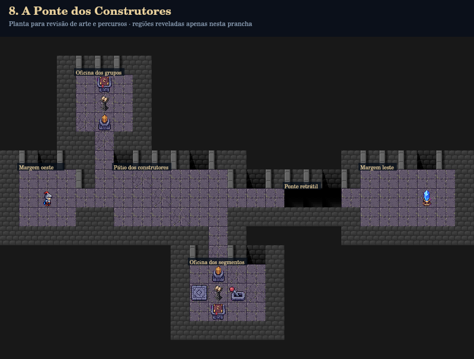

### Regiões e propósito

| Região | Posição e tamanho | Luz inicial | Função |
|---|---|---|---|
| Margem oeste (entrada) | 7,1; 3×3 | lit | Partida e orientação antes da primeira decisão. |
| Oficina dos grupos (oficina_a) | 2,4; 3×3 | dark | interruptor de luz: luz_a; inscrição: grupos; pedestal de entrada: pedestal_a |
| Pátio dos construtores (hub) | 7,6; 6×3 | lit | Bifurcação, acesso ou retorno entre regiões funcionais; sem sala de enchimento isolada. |
| Oficina dos segmentos (oficina_b) | 12,10; 4×3 | dark | interruptor de luz: luz_b; inscrição: segmentos; pedestal de entrada: pedestal_b; alavanca: lever; runa de saída: runa |
| Ponte retrátil (travessia) | 8,15; 3×1 | dark | ponte retrátil: bridge1; ponte retrátil: bridge2; ponte retrátil: bridge3 |
| Margem leste (final) | 7,19; 5×3 | dark | Cristal/recompensa, acessível após os requisitos físicos. |

### Pistas e dependências

- **grupos**, (2,5): Duas equipes trabalharam nesta margem. Cada equipe fabrica a mesma quantidade de segmentos registrada na outra oficina.
- **segmentos**, (14,11): Cada equipe fabrica três segmentos. Multiplique equipes por segmentos para produzir o material da ponte.

- **pedestal_a**: `{"requiresClues":["grupos"]}`
- **pedestal_b**: `{"requiresClues":["segmentos"]}`

Objetivos verificados: Investigue a oficina dos grupos; Investigue a oficina dos segmentos; Receba os dados descobertos com input(); Converta as entradas numéricas; Processe os valores no programa; Materialize a ponte; Alcance o cristal após liberar a passagem.

Solução integral no gabarito da raiz. Estado detalhado e evidências em `evidencias/auditoria.json`.

## 9. O Salão dos Espelhos Rúnicos

| Campo | Definição |
|---|---|
| Unidade / dificuldade | 2 / média-difícil |
| Objetivo | Encontre os fragmentos em duas alas, interprete seus valores e calcule qual espelho leva ao cofre. |
| Python | Múltiplas entradas e processamento; whitelist: variables, strings, booleans, arithmetic, input, int, print |
| Mapa | 29 × 17; início (8, 2), Leste |
| Regiões obrigatórias | Os dois arquivos, mesa dos espelhos e destino do cofre. |
| Estrutura | Duas pistas interpretativas e um pedestal central; destino correto isolado do salão, falsos espelhos não concedem recompensa. |
| Mecânicas | interruptor de luz, inscrição, pedestal de entrada, runa de saída, espelho, grade/cofre |
| Variantes | Cenário único |
| Tentativas esperadas | 4–6; estimativa, sem forçar repetição |
| Orçamento | 38 |

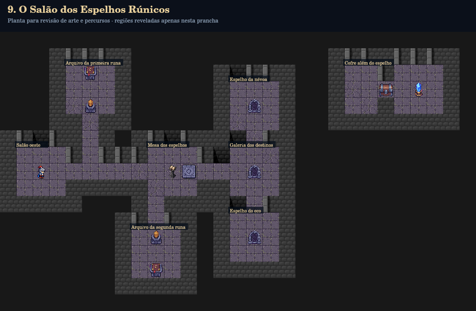

### Regiões e propósito

| Região | Posição e tamanho | Luz inicial | Função |
|---|---|---|---|
| Salão oeste (entrada) | 7,1; 3×3 | lit | Partida e orientação antes da primeira decisão. |
| Arquivo da primeira runa (runa_a) | 2,4; 3×3 | dark | interruptor de luz: luz_a; inscrição: primeira |
| Arquivo da segunda runa (runa_b) | 12,8; 3×3 | dark | interruptor de luz: luz_b; inscrição: segunda |
| Mesa dos espelhos (calculo) | 7,9; 3×3 | lit | pedestal de entrada: pedestal; runa de saída: runa |
| Galeria dos destinos (espelhos) | 7,14; 3×3 | lit | espelho: mirror5 |
| Espelho da névoa (falso_a) | 3,14; 3×3 | lit | espelho: mirror3 — alternativa/opcional |
| Espelho do eco (falso_b) | 11,14; 3×3 | lit | espelho: mirror7 — alternativa/opcional |
| Cofre além do espelho (final) | 2,21; 6×3 | dark | Cristal/recompensa, acessível após os requisitos físicos. |

### Pistas e dependências

- **primeira**, (2,5): O primeiro fragmento guarda o menor número primo.
- **segunda**, (14,9): O segundo fragmento guarda o número de lados de um triângulo. Some os fragmentos para escolher o espelho.

- **pedestal**: `{"requiresClues":["primeira","segunda"]}`
- **mirror5**: `{"requires":["mirrorReady"],"requiresClues":["primeira","segunda"]}`
- **cofre**: `{"requires":["correctMirror"]}`

Objetivos verificados: Leia o primeiro fragmento; Leia o segundo fragmento; Receba os dados descobertos com input(); Converta as entradas numéricas; Processe os valores no programa; Atravesse o espelho correspondente ao cálculo; Abra o cofre no destino; Respeite o orçamento de instruções; Alcance o cristal após liberar a passagem.

Solução integral no gabarito da raiz. Estado detalhado e evidências em `evidencias/auditoria.json`.

## 10. O Cofre das Três Runas

| Campo | Definição |
|---|---|
| Unidade / dificuldade | 2 / boss |
| Objetivo | Investigue as três alas, construa a travessia e processe os fragmentos para abrir o cofre central. |
| Python | Integração de entrada, processamento e saída; whitelist: variables, strings, booleans, arithmetic, input, int, print |
| Mapa | 26 × 21; início (10, 2), Leste |
| Regiões obrigatórias | Arquivos A, B e C; ponte e espelho de retorno; três selos iluminados. |
| Estrutura | Hub e três alas: produto de A e B monta a ponte; C completa o código; espelho retorna ao cofre e cada ala ilumina um selo do salão. |
| Mecânicas | interruptor de luz, inscrição, pedestal de entrada, alavanca, runa de saída, ponte retrátil, espelho, grade/cofre |
| Variantes | Cenário único |
| Tentativas esperadas | 5–7; estimativa, sem forçar repetição |
| Orçamento | 56 |

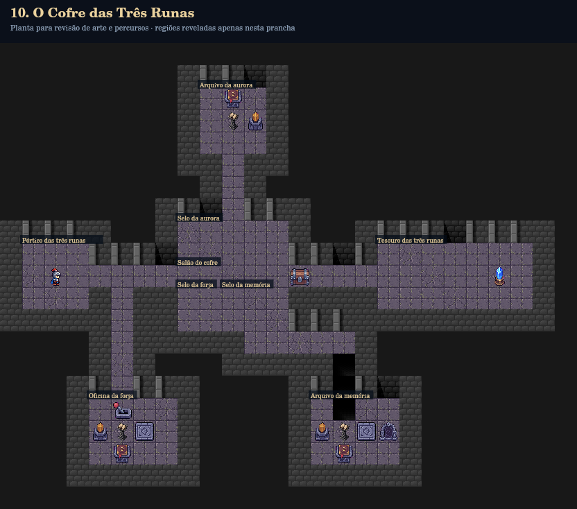

### Regiões e propósito

| Região | Posição e tamanho | Luz inicial | Função |
|---|---|---|---|
| Pórtico das três runas (entrada) | 9,1; 3×3 | lit | Partida e orientação antes da primeira decisão. |
| Selo da aurora (halo_a) | 8,8; 5×2 | dark | Selo visual do salão: ilumina ao investigar a ala correspondente; não exige pisar em cada casa. |
| Salão do cofre (hub) | 10,8; 5×1 | lit | Bifurcação, acesso ou retorno entre regiões funcionais; sem sala de enchimento isolada. |
| Selo da forja (halo_b) | 11,8; 2×2 | dark | Selo visual do salão: ilumina ao investigar a ala correspondente; não exige pisar em cada casa. |
| Selo da memória (halo_c) | 11,10; 3×2 | dark | Selo visual do salão: ilumina ao investigar a ala correspondente; não exige pisar em cada casa. |
| Arquivo da aurora (ala_a) | 2,9; 3×3 | dark | interruptor de luz: luz_a; inscrição: a; pedestal de entrada: pedestal_a |
| Oficina da forja (ala_b) | 16,4; 4×3 | dark | interruptor de luz: luz_b; inscrição: b; pedestal de entrada: pedestal_b; alavanca: lever; runa de saída: rune_b |
| Arquivo da memória (ala_c) | 16,14; 4×3 | dark | ponte retrátil: bridge3; interruptor de luz: luz_c; inscrição: c; pedestal de entrada: pedestal_c; runa de saída: rune_c; espelho: mirror5 |
| Tesouro das três runas (final) | 9,17; 7×3 | dark | Cristal/recompensa, acessível após os requisitos físicos. |

### Pistas e dependências

- **a**, (2,10): A marca A representa a unidade: 1. Guarde-a para a forja.
- **b**, (18,5): A marca B representa um par: 2. O produto A × B constrói a ponte do arquivo restante.
- **c**, (18,15): A marca C representa três vigias. Ao produto da forja, some os vigias para despertar o espelho do cofre.

- **pedestal_a**: `{"requiresClues":["a"]}`
- **pedestal_b**: `{"requiresClues":["b"]}`
- **pedestal_c**: `{"requiresClues":["c"]}`
- **mirror5**: `{"requires":["runesPrinted"]}`
- **cofre**: `{"requires":["leverDone","bridgeReady","runesPrinted","mirrorDone","light_halo_a","light_halo_b","light_halo_c"],"requiresClues":["a","b","c"]}`

Objetivos verificados: Descubra o fragmento da aurora; Descubra o fragmento da forja; Descubra o fragmento da memória; Receba os dados descobertos com input(); Converta as entradas numéricas; Processe os valores no programa; Construa a ponte da memória; Use o espelho de retorno; Abra o cofre central; Respeite o orçamento de instruções; Alcance o cristal após liberar a passagem.

Solução integral no gabarito da raiz. Estado detalhado e evidências em `evidencias/auditoria.json`.

## 11. A Porta do Guardião

| Campo | Definição |
|---|---|
| Unidade / dificuldade | 3 / tutorial |
| Objetivo | A chave está fora da rota principal. Explore a ala escura e use uma condição para liberar os bloqueios. |
| Python | if e condição booleana; whitelist: variables, strings, booleans, arithmetic, if, print |
| Mapa | 23 × 14; início (8, 2), Leste |
| Regiões obrigatórias | Ala remota da chave e retorno aos bloqueios. |
| Estrutura | Desvio ao norte para iluminar e coletar a chave; retorno a dois bloqueios condicionais. |
| Mecânicas | interruptor de luz, chave, porta, guardião |
| Variantes | Cenário único |
| Tentativas esperadas | 2–4; estimativa, sem forçar repetição |
| Orçamento | Sem limite específico; guardas globais continuam ativos |

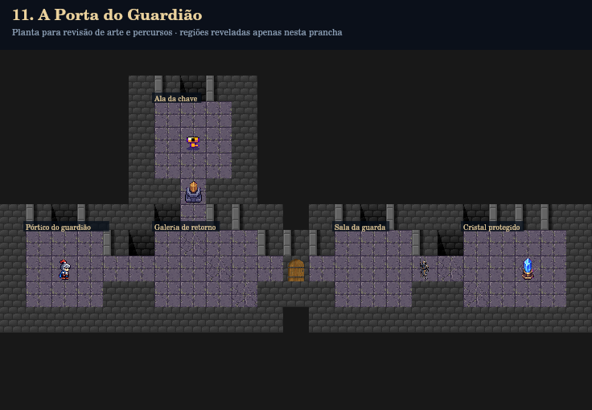

### Regiões e propósito

| Região | Posição e tamanho | Luz inicial | Função |
|---|---|---|---|
| Pórtico do guardião (entrada) | 7,1; 3×3 | lit | Partida e orientação antes da primeira decisão. |
| Ala da chave (chave) | 2,6; 3×3 | dark | chave: key |
| Galeria de retorno (corredor) | 7,6; 4×3 | lit | Bifurcação, acesso ou retorno entre regiões funcionais; sem sala de enchimento isolada. |
| Sala da guarda (guarda) | 7,13; 3×3 | lit | Bifurcação, acesso ou retorno entre regiões funcionais; sem sala de enchimento isolada. |
| Cristal protegido (final) | 7,18; 4×3 | dark | Cristal/recompensa, acessível após os requisitos físicos. |

### Pistas e dependências

Sem resposta textual secreta; investigação por geometria e estados físicos.

- **door**: `{"requiresKey":true}`
- **guardian**: `{"requiresKey":true}`

Objetivos verificados: Busque a chave na ala remota; Abra uma passagem dentro de uma condição; Abra a porta com a chave; Libere o Guardião; Alcance o cristal após liberar a passagem.

Solução integral no gabarito da raiz. Estado detalhado e evidências em `evidencias/auditoria.json`.

## 12. Os Dois Caminhos

| Campo | Definição |
|---|---|
| Unidade / dificuldade | 3 / fácil |
| Objetivo | Consulte o estado da placa na bifurcação e escolha a galeria segura com if e else. |
| Python | if / else; whitelist: variables, strings, booleans, arithmetic, if, else |
| Mapa | 25 × 17; início (8, 2), Leste |
| Regiões obrigatórias | Bifurcação e galeria segura conforme estado da placa. |
| Estrutura | Duas galerias físicas contornam a parede central; a placa determina qual linha de espinhos está recolhida. |
| Mecânicas | placa alternadora/lógica, interruptor de luz, espinhos, grade/cofre |
| Variantes | 0: placa ON/superior segura; 1: placa OFF/inferior segura |
| Tentativas esperadas | 3–4; estimativa, sem forçar repetição |
| Orçamento | Sem limite específico; guardas globais continuam ativos |

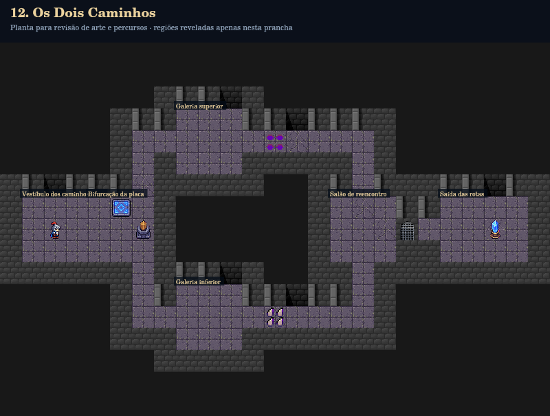

### Regiões e propósito

| Região | Posição e tamanho | Luz inicial | Função |
|---|---|---|---|
| Vestíbulo dos caminhos (entrada) | 7,1; 3×3 | lit | Partida e orientação antes da primeira decisão. |
| Bifurcação da placa (sensor) | 7,4; 3×3 | lit | placa alternadora/lógica: plate; interruptor de luz: luz |
| Galeria superior (upper) | 3,8; 3×3 | dark | Alternativa física do if/else; o estado do sensor determina a segurança da travessia. |
| Galeria inferior (lower) | 11,8; 3×3 | dark | Alternativa física do if/else; o estado do sensor determina a segurança da travessia. |
| Salão de reencontro (uniao) | 7,15; 3×3 | lit | Bifurcação, acesso ou retorno entre regiões funcionais; sem sala de enchimento isolada. |
| Saída das rotas (final) | 7,20; 4×3 | dark | Cristal/recompensa, acessível após os requisitos físicos. |

### Pistas e dependências

Sem resposta textual secreta; investigação por geometria e estados físicos.

- **selo**: `{"requires":[],"requiresAny":["visit_upper","visit_lower"]}`

Objetivos verificados: Avalie a condição com if; Preveja a alternativa com else; Faça o movimento depender da condição; Alcance o cristal após liberar a passagem.

Solução integral no gabarito da raiz. Estado detalhado e evidências em `evidencias/auditoria.json`.

## 13. A Câmara das Comparações

| Campo | Definição |
|---|---|
| Unidade / dificuldade | 3 / média |
| Objetivo | Descubra a energia da fonte e a regra dos validadores em arquivos separados. Compare os dados para abrir as passagens. |
| Python | Operadores relacionais; whitelist: variables, strings, booleans, arithmetic, input, int, if, comparison |
| Mapa | 26 × 17; início (8, 2), Leste |
| Regiões obrigatórias | Arquivo da energia, arquivo da medida e validadores. |
| Estrutura | Informação e limiar em alas opostas; as condições do código e os requisitos físicos dos Guardiões precisam concordar. |
| Mecânicas | interruptor de luz, inscrição, pedestal de entrada, guardião |
| Variantes | Cenário único |
| Tentativas esperadas | 3–5; estimativa, sem forçar repetição |
| Orçamento | Sem limite específico; guardas globais continuam ativos |

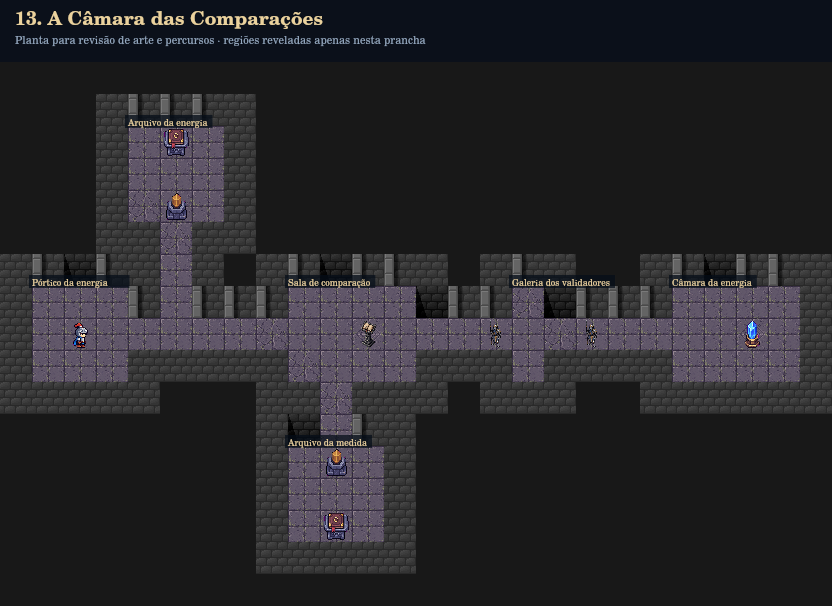

### Regiões e propósito

| Região | Posição e tamanho | Luz inicial | Função |
|---|---|---|---|
| Pórtico da energia (entrada) | 7,1; 3×3 | lit | Partida e orientação antes da primeira decisão. |
| Arquivo da energia (energia) | 2,4; 3×3 | dark | interruptor de luz: luz_a; inscrição: energia |
| Arquivo da medida (limiar) | 12,9; 3×3 | dark | interruptor de luz: luz_b; inscrição: limiar |
| Sala de comparação (pedestal) | 7,9; 4×3 | lit | pedestal de entrada: pedestal |
| Galeria dos validadores (guardas) | 7,16; 1×3 | lit | Bifurcação, acesso ou retorno entre regiões funcionais; sem sala de enchimento isolada. |
| Câmara da energia (final) | 7,21; 4×3 | dark | Cristal/recompensa, acessível após os requisitos físicos. |

### Pistas e dependências

- **energia**, (2,5): A fonte conserva uma dúzia de unidades de energia. Receba essa quantidade no pedestal.
- **limiar**, (14,10): O primeiro selo exige energia maior ou igual a uma dezena. O segundo rejeita energia igual a zero.

- **pedestal**: `{"requiresClues":["energia","limiar"]}`
- **guardian_high**: `{"requiresClues":["energia","limiar"],"condition":{"input":"pedestal","operator":">=","value":10}}`
- **guardian_second**: `{"requires":["guardian_highOpen"],"condition":{"input":"pedestal","operator":"!=","value":0}}`

Objetivos verificados: Encontre o registro da fonte; Encontre a regra dos validadores; Compare os valores encontrados; Abra as passagens por blocos condicionais; Libere o primeiro validador; Libere o segundo validador; Alcance o cristal após liberar a passagem.

Solução integral no gabarito da raiz. Estado detalhado e evidências em `evidencias/auditoria.json`.

## 14. O Selo das Duas Alavancas

| Campo | Definição |
|---|---|
| Unidade / dificuldade | 3 / média-difícil |
| Objetivo | Ative as duas alas e use condições combinadas. Uma passagem aceita qualquer alavanca; o selo final exige ambas. |
| Python | and / or; whitelist: variables, strings, booleans, arithmetic, if, and, or |
| Mapa | 28 × 18; início (8, 2), Leste |
| Regiões obrigatórias | Ala azul, ala verde e placa de segurança; portões OU e E. |
| Estrutura | OU libera a passagem com apenas a ala azul; a ala verde exige passar pela placa que recolhe espinhos; E libera o último selo. |
| Mecânicas | interruptor de luz, alavanca, placa alternadora/lógica, espinhos, grade/cofre |
| Variantes | Cenário único |
| Tentativas esperadas | 4–6; estimativa, sem forçar repetição |
| Orçamento | 40 |

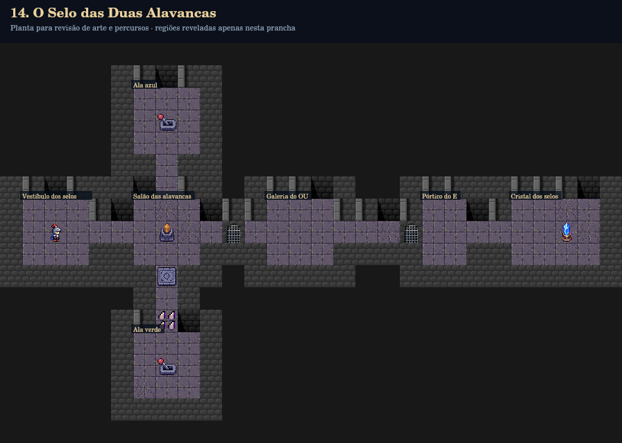

### Regiões e propósito

| Região | Posição e tamanho | Luz inicial | Função |
|---|---|---|---|
| Vestíbulo dos selos (entrada) | 7,1; 3×3 | lit | Partida e orientação antes da primeira decisão. |
| Salão das alavancas (hub) | 7,6; 3×3 | lit | interruptor de luz: luz |
| Ala azul (azul) | 2,6; 3×3 | dark | alavanca: lever_blue |
| Ala verde (verde) | 13,6; 3×3 | dark | alavanca: lever_green |
| Galeria do OU (or) | 7,12; 3×3 | lit | Bifurcação, acesso ou retorno entre regiões funcionais; sem sala de enchimento isolada. |
| Pórtico do E (and) | 7,19; 2×3 | lit | Bifurcação, acesso ou retorno entre regiões funcionais; sem sala de enchimento isolada. |
| Cristal dos selos (final) | 7,23; 4×3 | dark | Cristal/recompensa, acessível após os requisitos físicos. |

### Pistas e dependências

Sem resposta textual secreta; investigação por geometria e estados físicos.

- **gate_side**: `{"requiresAny":["lever_blue","lever_green"]}`
- **gate_main**: `{"requires":["lever_blue","lever_green"]}`

Objetivos verificados: Ative a ala azul; Ative a ala verde; Combine condições com and; Combine condições com or; Controle a abertura com condições; Abra a passagem de OU; Abra o selo de E; Respeite o orçamento de instruções; Alcance o cristal após liberar a passagem.

Solução integral no gabarito da raiz. Estado detalhado e evidências em `evidencias/auditoria.json`.

## 15. O Julgamento dos Três Portões

| Campo | Definição |
|---|---|
| Unidade / dificuldade | 3 / boss |
| Objetivo | Investigue os três arquivos, reúna os selos e classifique o poder descoberto para escolher o portão do julgamento. |
| Python | if / elif / else e integração; whitelist: variables, strings, booleans, arithmetic, input, int, if, elif, else, comparison |
| Mapa | 35 × 25; início (12, 2), Leste |
| Regiões obrigatórias | Arquivos do Sol, Lua e Sombra; chave, alavanca e destino do ramo correto. |
| Estrutura | Três setores obrigatórios revelam limiares, chave, alavanca e poder variável; três destinos convergem apenas após um portal legítimo. |
| Mecânicas | interruptor de luz, inscrição, chave, alavanca, pedestal de entrada, portal, grade/cofre |
| Variantes | 0: Sol (entradas 25); 1: Lua (entradas 15); 2: Sombra (entradas 5) |
| Tentativas esperadas | 5–7; estimativa, sem forçar repetição |
| Orçamento | 65 |

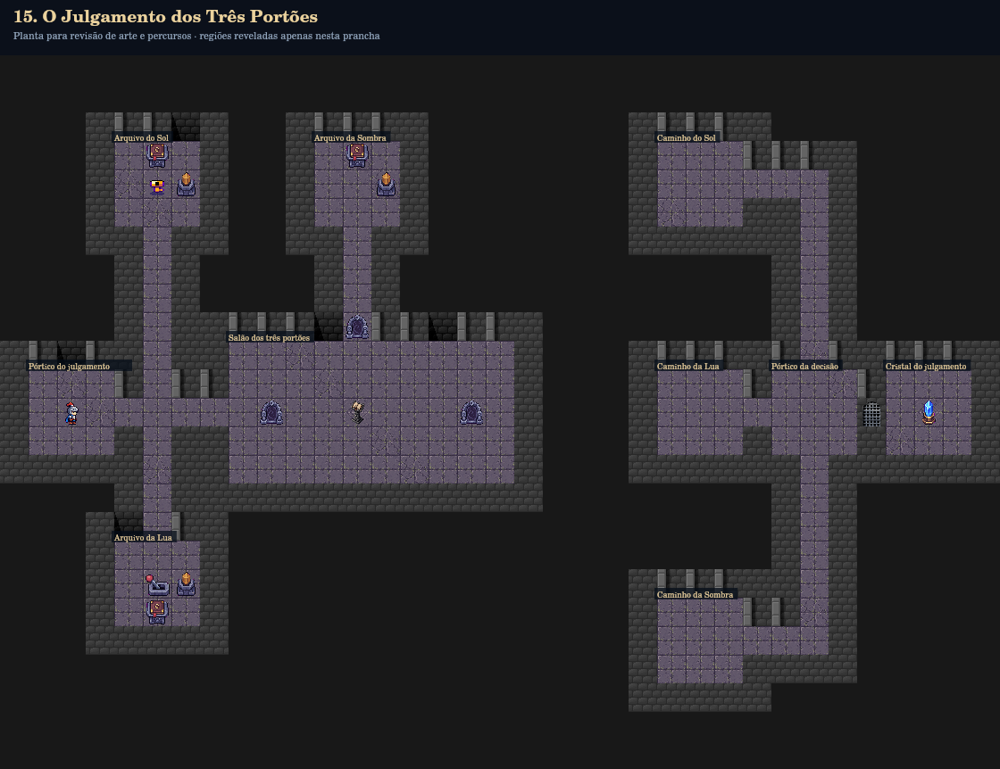

### Regiões e propósito

| Região | Posição e tamanho | Luz inicial | Função |
|---|---|---|---|
| Pórtico do julgamento (entrada) | 11,1; 3×3 | lit | Partida e orientação antes da primeira decisão. |
| Arquivo do Sol (sol) | 3,4; 3×3 | dark | interruptor de luz: luz_sol; inscrição: sol; chave: key |
| Arquivo da Lua (lua) | 17,4; 3×3 | dark | interruptor de luz: luz_lua; inscrição: lua; alavanca: lever |
| Arquivo da Sombra (sombra) | 3,11; 3×3 | dark | interruptor de luz: luz_sombra; inscrição: sombra |
| Salão dos três portões (hub) | 10,8; 10×5 | lit | pedestal de entrada: power_pedestal; portal: portal3; portal: portal1 |
| Caminho do Sol (destino_sol) | 3,23; 3×3 | dark | Destino físico de um ramo do julgamento, convergindo à saída. |
| Caminho da Lua (destino_lua) | 11,23; 3×3 | dark | Destino físico de um ramo do julgamento, convergindo à saída. |
| Caminho da Sombra (destino_sombra) | 19,23; 3×3 | dark | Destino físico de um ramo do julgamento, convergindo à saída. |
| Pórtico da decisão (uniao) | 11,27; 3×3 | lit | Bifurcação, acesso ou retorno entre regiões funcionais; sem sala de enchimento isolada. |
| Cristal do julgamento (final) | 11,31; 3×3 | dark | Cristal/recompensa, acessível após os requisitos físicos. |

### Pistas e dependências

- **sol**, (3,5): O Sol reconhece poder maior ou igual a 20. O portão solar usa o identificador 3.
- **lua**, (19,5): A Lua reconhece poder a partir de 10 quando a lei do Sol não foi atendida. Seu identificador é 2.
- **sombra**, (3,12): A Sombra recebe o poder abaixo do limiar lunar, pelo portão 1. O poder inscrito nesta tentativa é 25. / A Sombra recebe o poder abaixo do limiar lunar, pelo portão 1. O poder inscrito nesta tentativa é 15. / A Sombra recebe o poder abaixo do limiar lunar, pelo portão 1. O poder inscrito nesta tentativa é 5.

- **power_pedestal**: `{"requiresClues":["sol","lua","sombra"]}`
- **portal3**: `{"requiresKey":true,"requires":["leverDone","read_sol","read_lua","read_sombra"]}`
- **portal2**: `{"requiresKey":true,"requires":["leverDone","read_sol","read_lua","read_sombra"]}`
- **portal1**: `{"requiresKey":true,"requires":["leverDone","read_sol","read_lua","read_sombra"]}`
- **gate**: `{"requiresKey":true,"requires":["leverDone","correctPortal","read_sol","read_lua","read_sombra"]}`

Objetivos verificados: Investigue a lei do Sol; Investigue a lei da Lua; Descubra o poder e a lei da Sombra; Recolha a chave do julgamento; Ative o selo da Lua; Use if na classificação; Use elif na classificação; Use else na classificação; Use comparações na classificação; Faça o portão depender da classificação; Entre no portão legítimo; Libere a saída do julgamento; Respeite o orçamento de instruções; Alcance o cristal após liberar a passagem.

Solução integral no gabarito da raiz. Estado detalhado e evidências em `evidencias/auditoria.json`.

## 16. A Ponte dos Ecos

| Campo | Definição |
|---|---|
| Unidade / dificuldade | 4 / tutorial |
| Objetivo | Visite a galeria e transforme o padrão dos totens em uma repetição. Cada ativação constrói uma parte da ponte. |
| Python | for + range(); whitelist: variables, strings, booleans, arithmetic, for, range |
| Mapa | 24 × 15; início (10, 2), Leste |
| Regiões obrigatórias | Galeria dos totens, retorno e ponte de cinco segmentos. |
| Estrutura | Desvio à galeria de cinco totens, retorno por uma escada e travessia de cinco segmentos físicos. |
| Mecânicas | interruptor de luz, inscrição, totem, segmento de ponte |
| Variantes | Cenário único |
| Tentativas esperadas | 2–4; estimativa, sem forçar repetição |
| Orçamento | Sem limite específico; guardas globais continuam ativos |

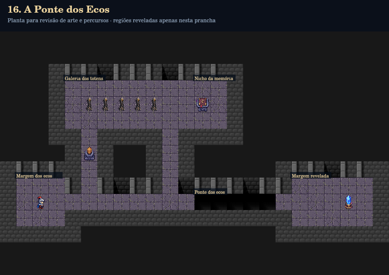

### Regiões e propósito

| Região | Posição e tamanho | Luz inicial | Função |
|---|---|---|---|
| Margem dos ecos (entrada) | 9,1; 3×3 | lit | Partida e orientação antes da primeira decisão. |
| Galeria dos totens (galeria) | 3,4; 8×3 | dark | totem: t1; totem: t2; totem: t3; totem: t4; totem: t5 |
| Nicho da memória (inscricao) | 3,12; 2×3 | dark | inscrição: ecos — alternativa/opcional |
| Ponte dos ecos (ponte) | 10,12; 5×1 | dark | segmento de ponte: bridge1; segmento de ponte: bridge2; segmento de ponte: bridge3; segmento de ponte: bridge4; segmento de ponte: bridge5 |
| Margem revelada (final) | 9,18; 5×3 | dark | Cristal/recompensa, acessível após os requisitos físicos. |

### Pistas e dependências

- **ecos**, (4,12): Cada totem responde uma vez. O eco de uma ativação materializa um segmento da travessia.

Objetivos verificados: Ative os totens dentro de for; Repita o padrão com for e range(); Construa o segmento 1; Construa o segmento 2; Construa o segmento 3; Construa o segmento 4; Construa o segmento 5; Alcance o cristal após liberar a passagem.

Solução integral no gabarito da raiz. Estado detalhado e evidências em `evidencias/auditoria.json`.

## 17. A Câmara dos Rubis

| Campo | Definição |
|---|---|
| Unidade / dificuldade | 4 / fácil |
| Objetivo | Percorra os nichos repetidos, recolha os rubis e atualize um acumulador para abrir a porta da contagem. |
| Python | for + acumulador; whitelist: variables, strings, booleans, arithmetic, for, range, if, comparison |
| Mapa | 29 × 13; início (8, 2), Leste |
| Regiões obrigatórias | Os cinco nichos de rubis e porta do contador. |
| Estrutura | Cinco nichos com o mesmo desvio e retorno; uma porta física exige a contagem real de rubis. |
| Mecânicas | coletável, interruptor de luz, inscrição, porta |
| Variantes | Cenário único |
| Tentativas esperadas | 3–5; estimativa, sem forçar repetição |
| Orçamento | Sem limite específico; guardas globais continuam ativos |

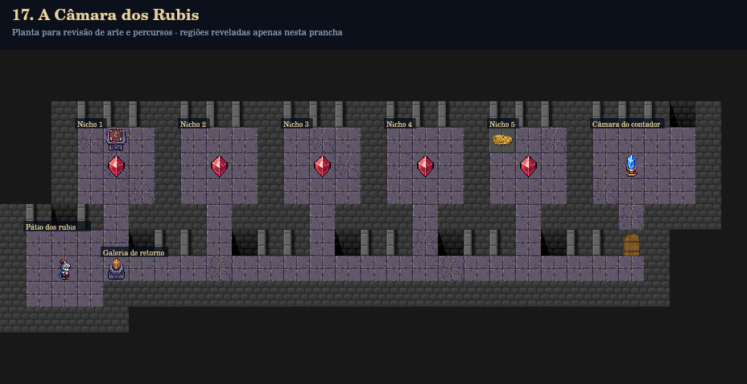

### Regiões e propósito

| Região | Posição e tamanho | Luz inicial | Função |
|---|---|---|---|
| Pátio dos rubis (entrada) | 7,1; 3×3 | lit | Partida e orientação antes da primeira decisão. |
| Galeria de retorno (galeria) | 8,4; 21×1 | lit | interruptor de luz: luz |
| Câmara do contador (final) | 3,23; 4×3 | dark | Cristal/recompensa, acessível após os requisitos físicos. |
| Nicho 1 (nicho1) | 3,3; 3×3 | dark | coletável: r1; inscrição: lore |
| Nicho 2 (nicho2) | 3,7; 3×3 | dark | coletável: r2 |
| Nicho 3 (nicho3) | 3,11; 3×3 | dark | coletável: r3 |
| Nicho 4 (nicho4) | 3,15; 3×3 | dark | coletável: r4 |
| Nicho 5 (nicho5) | 3,19; 3×3 | dark | coletável: r5; coletável: bonus |

### Pistas e dependências

- **lore**, (3,4): O lapidador guardou uma gema em cada nicho. Uma contagem cresce a cada visita.

- **door**: `{"minRubies":5}`

Objetivos verificados: Colete o padrão de rubis dentro do laço; Atualize um acumulador até a contagem necessária; Abra a porta usando o total; Use uma condição para conferir a contagem; Alcance o cristal após liberar a passagem.

Solução integral no gabarito da raiz. Estado detalhado e evidências em `evidencias/auditoria.json`.

## 18. O Corredor das Placas

| Campo | Definição |
|---|---|
| Unidade / dificuldade | 4 / média |
| Objetivo | O comprimento útil varia. Consulte o sensor, ilumine cada trecho e repita a neutralização até o padrão terminar. |
| Python | while e condição de continuidade; whitelist: variables, strings, booleans, arithmetic, while |
| Mapa | 26 × 24; início (2, 2), Leste |
| Regiões obrigatórias | Três, quatro ou cinco módulos ativos conforme cenário; retorno convergente. |
| Estrutura | Módulos em escada com três, quatro ou cinco armadilhas ativas; saídas de retorno convergem em um selo que exige completar a sequência do cenário. |
| Mecânicas | interruptor de luz, espinhos, placa alternadora/lógica, grade/cofre |
| Variantes | 0: 3 módulos; 1: 4 módulos; 2: 5 módulos |
| Tentativas esperadas | 4–6; estimativa, sem forçar repetição |
| Orçamento | Sem limite específico; guardas globais continuam ativos |

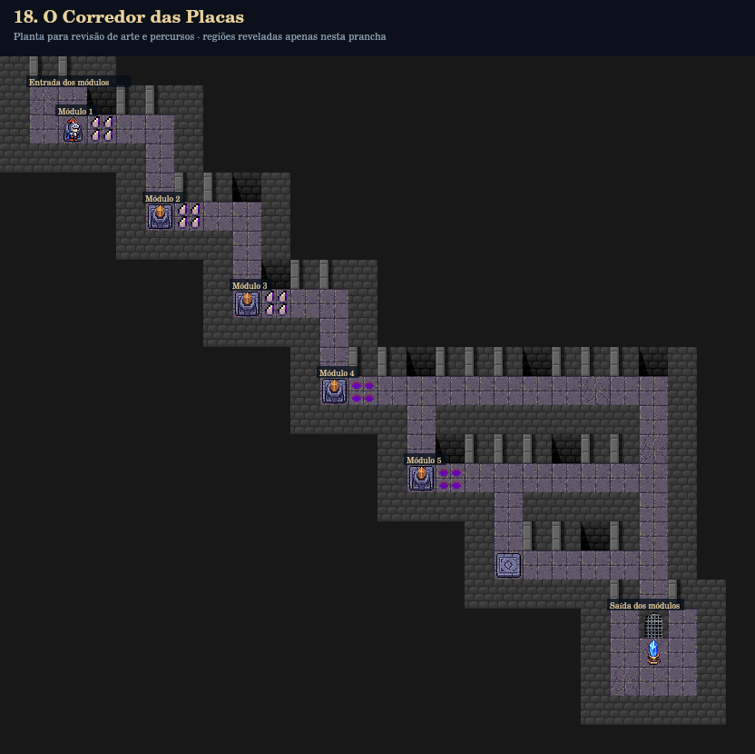

### Regiões e propósito

| Região | Posição e tamanho | Luz inicial | Função |
|---|---|---|---|
| Entrada dos módulos (entrada) | 1,1; 2×2 | lit | Partida e orientação antes da primeira decisão. |
| Saída dos módulos (final) | 19,21; 3×3 | dark | Cristal/recompensa, acessível após os requisitos físicos. |
| Módulo 1 (modulo1) | 2,2; 4×4 | dark | interruptor de luz: luz1; espinhos: h1; placa alternadora/lógica: p1; interruptor de luz: luz2 |
| Módulo 2 (modulo2) | 5,5; 4×4 | dark | placa alternadora/lógica: p1; interruptor de luz: luz2; espinhos: h2; placa alternadora/lógica: p2; interruptor de luz: luz3 |
| Módulo 3 (modulo3) | 8,8; 4×4 | deepDark | placa alternadora/lógica: p2; interruptor de luz: luz3; espinhos: h3; placa alternadora/lógica: p3; interruptor de luz: luz4 |
| Módulo 4 (modulo4) | 11,11; 4×4 | deepDark | placa alternadora/lógica: p3; interruptor de luz: luz4; espinhos: h4; placa alternadora/lógica: p4; interruptor de luz: luz5 |
| Módulo 5 (modulo5) | 14,14; 4×4 | deepDark | placa alternadora/lógica: p4; interruptor de luz: luz5; espinhos: h5; placa alternadora/lógica: p5 |

### Pistas e dependências

Sem resposta textual secreta; investigação por geometria e estados físicos.

- **gate**: `{"requires":[],"variantMinTraps":[3,4,5]}`

Objetivos verificados: Repita enquanto o sensor detectar continuidade; Neutralize os espinhos dentro de while; Complete todos os módulos ativos do cenário; Alcance o cristal após liberar a passagem.

Solução integral no gabarito da raiz. Estado detalhado e evidências em `evidencias/auditoria.json`.

## 19. A Chave Perdida

| Campo | Definição |
|---|---|
| Unidade / dificuldade | 4 / média-difícil |
| Objetivo | A chave muda de baú. Investigue as criptas com while e interrompa a busca assim que encontrá-la. |
| Python | while + break; whitelist: variables, strings, booleans, arithmetic, while, if, break, elif, else, comparison |
| Mapa | 26 × 15; início (10, 2), Leste |
| Regiões obrigatórias | Criptas pesquisadas até a chave; retorno à porta. O prefixo visitado varia. |
| Estrutura | Três câmaras de busca ligadas por galeria superior e retornos próprios; a saída distante exige a chave descoberta. |
| Mecânicas | baú, interruptor de luz, porta |
| Variantes | 0: chave em chest1; 1: chave em chest2; 2: chave em chest3 |
| Tentativas esperadas | 4–7; estimativa, sem forçar repetição |
| Orçamento | 30 |

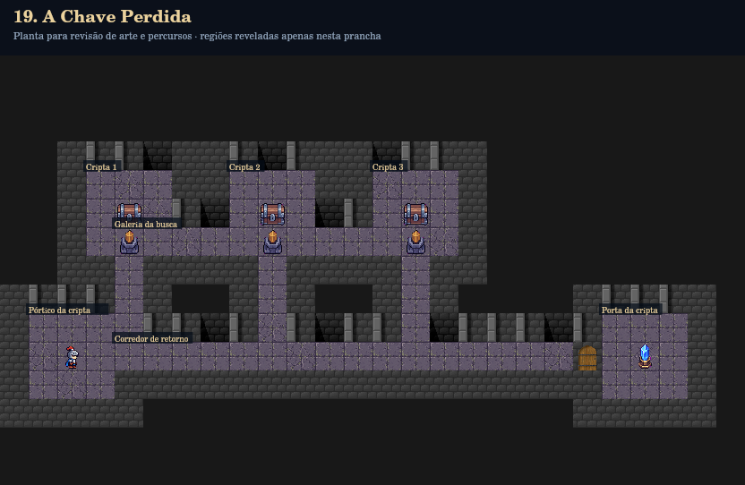

### Regiões e propósito

| Região | Posição e tamanho | Luz inicial | Função |
|---|---|---|---|
| Pórtico da cripta (entrada) | 9,1; 3×3 | lit | Partida e orientação antes da primeira decisão. |
| Galeria da busca (hub) | 6,4; 11×1 | lit | interruptor de luz: luz1; interruptor de luz: luz2; interruptor de luz: luz3 |
| Corredor de retorno (retorno) | 10,4; 15×1 | lit | Bifurcação, acesso ou retorno entre regiões funcionais; sem sala de enchimento isolada. |
| Porta da cripta (final) | 9,21; 3×3 | dark | Cristal/recompensa, acessível após os requisitos físicos. |
| Cripta 1 (cripta1) | 4,3; 3×3 | dark | baú: chest1; interruptor de luz: luz1 |
| Cripta 2 (cripta2) | 4,8; 3×3 | dark | baú: chest2; interruptor de luz: luz2 |
| Cripta 3 (cripta3) | 4,13; 3×3 | dark | baú: chest3; interruptor de luz: luz3 |

### Pistas e dependências

Sem resposta textual secreta; investigação por geometria e estados físicos.

- **door**: `{"requiresKey":true}`

Objetivos verificados: Busque os baús dentro de while; Interrompa o laço com break; Encerre a busca no baú da chave; Encontre a chave variável; Abra a porta distante; Respeite o orçamento de instruções; Alcance o cristal após liberar a passagem.

Solução integral no gabarito da raiz. Estado detalhado e evidências em `evidencias/auditoria.json`.

## 20. O Santuário do Basilisco

| Campo | Definição |
|---|---|
| Unidade / dificuldade | 4 / boss |
| Objetivo | Reúna os selos das alas de runas, espinhos, busca e rubis. Volte ao santuário e formule o julgamento final. |
| Python | Integração final das quatro unidades; whitelist: variables, strings, booleans, arithmetic, for, range, while, if, break, comparison, and |
| Mapa | 32 × 27; início (14, 2), Leste |
| Regiões obrigatórias | Galeria das runas, ala de espinhos, busca da chave, três rubis e julgamento. |
| Estrutura | Hub liga quatro provas conhecidas: for constrói a ponte, while atravessa espinhos, while/break encontra a chave e o acumulador reúne rubis; a condição abre o Basilisco. |
| Mecânicas | interruptor de luz, totem, segmento de ponte, espinhos, baú, coletável, inscrição, guardião |
| Variantes | 0: chave em chest1; 1: chave em chest2; 2: chave em chest3 |
| Tentativas esperadas | 6–10; estimativa, sem forçar repetição |
| Orçamento | 72 |

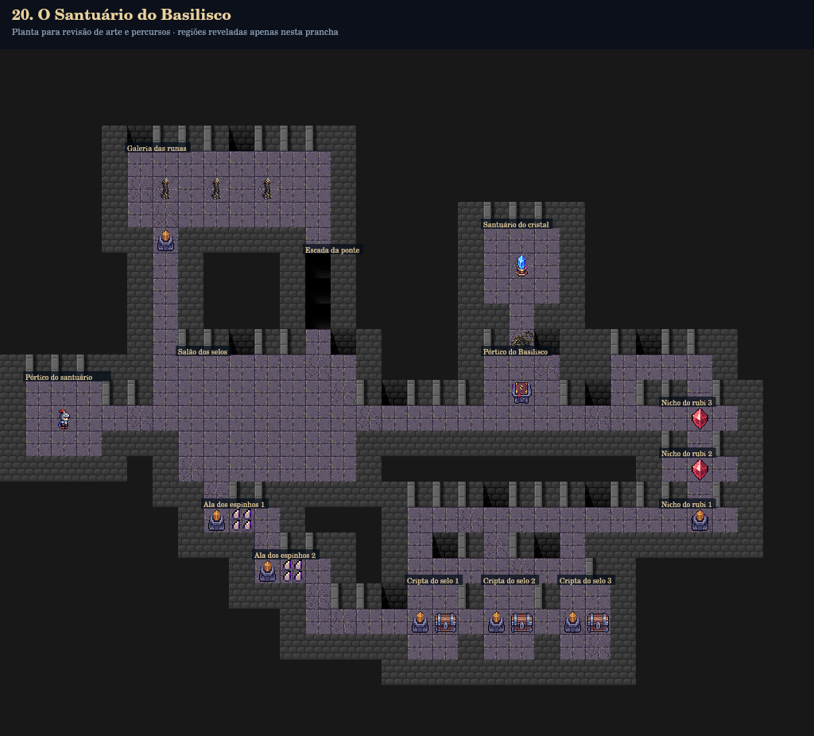

### Regiões e propósito

| Região | Posição e tamanho | Luz inicial | Função |
|---|---|---|---|
| Pórtico do santuário (entrada) | 13,1; 3×3 | lit | Partida e orientação antes da primeira decisão. |
| Salão dos selos (hub) | 12,7; 7×5 | dark | Bifurcação, acesso ou retorno entre regiões funcionais; sem sala de enchimento isolada. |
| Galeria das runas (runas) | 4,5; 8×3 | dark | totem: t1; totem: t2; totem: t3 |
| Escada da ponte (ponte) | 8,12; 1×3 | dark | segmento de ponte: bridge1; segmento de ponte: bridge2; segmento de ponte: bridge3 |
| Santuário do cristal (final) | 7,19; 3×3 | dark | Cristal/recompensa, acessível após os requisitos físicos. |
| Pórtico do Basilisco (julgamento) | 12,19; 3×3 | dark | inscrição: lei |
| Ala dos espinhos 1 (traps1) | 18,8; 3×3 | deepDark | interruptor de luz: luz_traps1; espinhos: h1; interruptor de luz: luz_traps2 |
| Ala dos espinhos 2 (traps2) | 20,10; 3×3 | deepDark | interruptor de luz: luz_traps2; espinhos: h2 |
| Cripta do selo 1 (cripta1) | 21,16; 2×3 | dark | baú: chest1; interruptor de luz: luz_busca1 |
| Cripta do selo 2 (cripta2) | 21,19; 2×3 | dark | baú: chest2; interruptor de luz: luz_busca2 |
| Cripta do selo 3 (cripta3) | 21,22; 2×3 | dark | baú: chest3; interruptor de luz: luz_busca3 |
| Nicho do rubi 1 (rubi1) | 18,26; 3×1 | dark | coletável: r1; interruptor de luz: luz_rubis |
| Nicho do rubi 2 (rubi2) | 16,26; 3×1 | dark | coletável: r2 |
| Nicho do rubi 3 (rubi3) | 14,26; 3×1 | dark | coletável: r3 |

### Pistas e dependências

- **lei**, (13,20): O Basilisco reconhece as três runas, a neutralização dos espinhos, a chave encontrada e os três rubis. A condição final deve refletir os selos conquistados.

- **basilisk**: `{"requiresKey":true,"minRunes":3,"minTraps":2,"minRubies":3,"requiresClues":["lei"]}`

Objetivos verificados: Use for na ala da ponte; Use while nos espinhos; Faça a busca com laço; Pare ao encontrar a chave; Encerre a busca assim que a chave aparecer; Repita a coleta de rubis; Atualize o acumulador dos rubis; Leia o julgamento no santuário; Combine as condições finais; Remova as proteções do Basilisco; Respeite o orçamento de instruções; Alcance o cristal após liberar a passagem.

Solução integral no gabarito da raiz. Estado detalhado e evidências em `evidencias/auditoria.json`.

